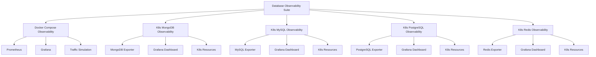

# Database Observability Suite

Welcome to the **Database Observability Suite**! This repository contains a collection of resources and configurations to enable observability for various database systems. Each folder is tailored to a specific database or observability setup, providing dashboards, exporters, and Kubernetes manifests to monitor and analyze database performance effectively.

---

## Architecture Diagram

Below is a high-level architecture diagram of the repository structure:



---

## Folder Overview

### `docker-compose-observability/`
A Docker Compose setup for local observability. Includes configurations for:
- **Prometheus**: Metrics collection and alerting.
- **Grafana**: Visualization dashboards.
- **Traffic Simulation**: A script to generate sample traffic.

### `k8s-mongodb-observability/`
Kubernetes manifests for MongoDB observability. Includes:
- **MongoDB Exporter**: Collects metrics from MongoDB.
- **Grafana Dashboard**: Pre-configured MongoDB performance visualization.
- **Kubernetes Resources**: Secrets, services, and StatefulSets.

### `k8s-mysql-observability/`
Kubernetes manifests for MySQL observability. Includes:
- **MySQL Exporter**: Collects metrics from MySQL.
- **Grafana Dashboard**: Pre-configured MySQL performance visualization.
- **Kubernetes Resources**: Secrets, services, and StatefulSets.

### `k8s-postgres-observability/`
Kubernetes manifests for PostgreSQL observability. Includes:
- **PostgreSQL Exporter**: Collects metrics from PostgreSQL.
- **Grafana Dashboard**: Pre-configured PostgreSQL performance visualization.
- **Kubernetes Resources**: Secrets, services, and StatefulSets.

### `k8s-redis-observability/`
Kubernetes manifests for Redis observability. Includes:
- **Redis Exporter**: Collects metrics from Redis.
- **Grafana Dashboard**: Pre-configured Redis performance visualization.
- **Kubernetes Resources**: Secrets, services, and StatefulSets.

---

## Quick Start
1. Clone the repository:
   ```bash
   git clone https://github.com/your-repo/database-observability-suite.git
   ```
2. Navigate to the desired folder and follow the README instructions within.
3. Deploy the observability stack locally or on Kubernetes.
---

Happy monitoring! 🚀
