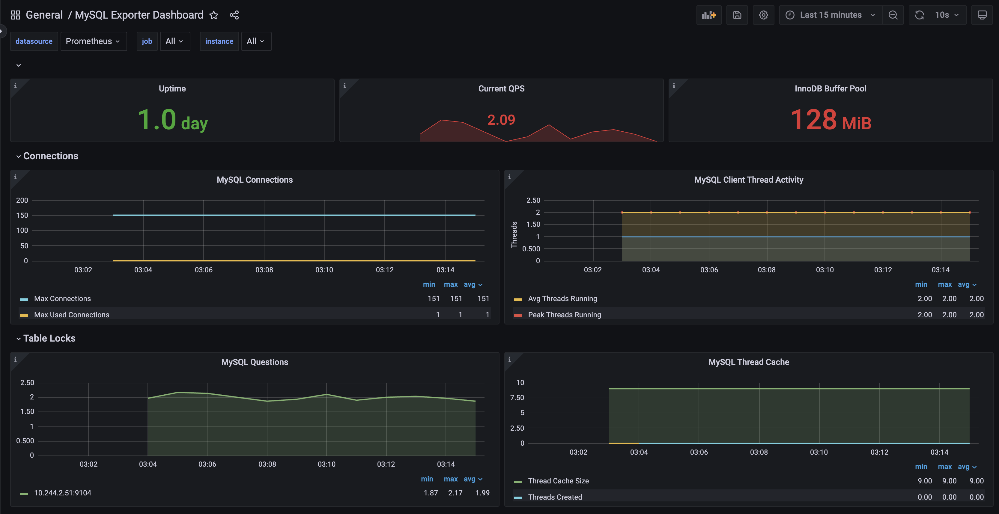

# MySQL Observability on Kubernetes

Monitor a MySQL StatefulSet in Kubernetes using **Prometheus** + **MySQL Exporter** + **Grafana**.

---

## Architecture

```
mysql-0 (StatefulSet)
    └── mysql-exporter (Helm) → Prometheus (ServiceMonitor) → Grafana Dashboard
```

| Component | Tool |
|-----------|------|
| Database | MySQL 8.0 — StatefulSet with 1Gi PVC |
| Metrics Exporter | prometheus-mysql-exporter (Helm) |
| Metrics Collection | Prometheus via ServiceMonitor |
| Visualization | Grafana — MySQL Exporter Dashboard |

---

## Prerequisites

- Kubernetes cluster (Docker Desktop)
- `kubectl` and `helm` installed
- Prometheus + Grafana running in `monitoring` namespace

---

## Setup

### 1. Create Namespace & MySQL

```bash
kubectl create namespace database-monitoring

kubectl apply -f mysql/mysql-secret.yaml
kubectl apply -f mysql/mysql-service.yaml
kubectl apply -f mysql/mysql-statefulset.yaml
```

### 2. Install MySQL Exporter

```bash
helm repo add prometheus-community https://prometheus-community.github.io/helm-charts
helm repo update

helm install mysql-exporter prometheus-community/prometheus-mysql-exporter \
  -f mysql-exporter/mysql-exporter-values.yaml \
  -n database-monitoring
```

### 3. Deploy Grafana Dashboard

```bash
kubectl apply -f grafana/mysql-dashboard.yaml -n monitoring
```

Restart Grafana to pick up the new dashboard:

```bash
kubectl rollout restart deployment prometheus-grafana -n monitoring
```

---

## Grafana Dashboard

To better understand the MySQL observability setup, refer to the dashboard image below. It provides a clear visualization of the metrics and insights available for monitoring MySQL:



---

## File Structure

```
k8s-mysql-observability/
├── mysql/
│   ├── mysql-secret.yaml         # Base64 encoded credentials
│   ├── mysql-service.yaml        # ClusterIP service on port 3306
│   └── mysql-statefulset.yaml    # StatefulSet with 1Gi PVC
├── mysql-exporter/
│   └── mysql-exporter-values.yaml  # Helm values with ServiceMonitor
├── grafana/
│   └── mysql-dashboard.yaml      # ConfigMap with dashboard JSON
└── assets/
    └── grafana-dashboard.png     # Dashboard screenshot
```

---

## Key Notes

- MySQL credentials are stored as a Kubernetes Secret and injected via `secretKeyRef`
- The StatefulSet uses a `volumeClaimTemplate` to dynamically provision a PVC per replica, persisting data at `/var/lib/mysql`
- The MySQL Exporter connects to MySQL over the cluster DNS: `mysql.database-monitoring.svc.cluster.local`
- The `ServiceMonitor` uses `release: prometheus` label to be discovered by the Prometheus Operator
