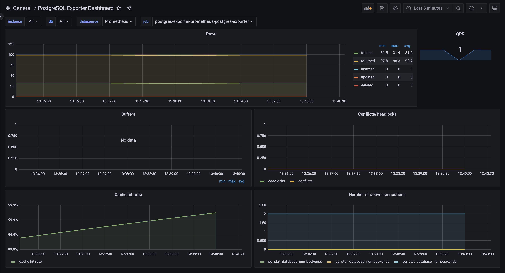

# PostgreSQL Observability on Kubernetes

Monitor a PostgreSQL StatefulSet in Kubernetes using **Prometheus** + **PostgreSQL Exporter** + **Grafana**.

---

## Architecture

```
postgresql-0 (StatefulSet)
    └── postgres-exporter (Helm) → Prometheus (ServiceMonitor) → Grafana Dashboard
```

| Component | Tool |
|-----------|------|
| Database | PostgreSQL 13 — StatefulSet with 1Gi PVC |
| Metrics Exporter | prometheus-postgres-exporter (Helm) |
| Metrics Collection | Prometheus via ServiceMonitor |
| Visualization | Grafana — PostgreSQL Dashboard |

---

## Prerequisites

- Kubernetes cluster (Docker Desktop)
- `kubectl` and `helm` installed
- Prometheus + Grafana running in `monitoring` namespace

---

## Setup

### 1. Create Namespace & PostgreSQL

```bash
kubectl create namespace database-monitoring

kubectl apply -f postgres/postgresql-secret.yaml
kubectl apply -f postgres/postgresql-service.yaml
kubectl apply -f postgres/postgresql-statefulset.yaml
```

### 2. Install PostgreSQL Exporter

```bash
helm repo add prometheus-community https://prometheus-community.github.io/helm-charts
helm repo update

helm install postgres-exporter prometheus-community/prometheus-postgres-exporter \
  -f postgres-exporter/postgresql-exporter-values.yaml \
  -n database-monitoring
```

### 3. Deploy Grafana Dashboard

```bash
kubectl apply -f grafana/postgres-dashboard.yaml -n monitoring
```

Restart Grafana to pick up the new dashboard:

```bash
kubectl rollout restart deployment prometheus-grafana -n monitoring
```

---

## Grafana Dashboard

To better understand the PostgreSQL observability setup, refer to the dashboard image below. It provides a clear visualization of the metrics and insights available for monitoring PostgreSQL:



---

## File Structure

```
k8s-postgres-observability/
├── postgres/
│   ├── postgresql-secret.yaml          # Base64 encoded credentials
│   ├── postgresql-service.yaml         # ClusterIP service on port 5432
│   └── postgresql-statefulset.yaml     # StatefulSet with 1Gi PVC
├── postgres-exporter/
│   └── postgresql-exporter-values.yaml # Helm values with ServiceMonitor
├── grafana/
│   └── postgres-dashboard.yaml         # ConfigMap with dashboard JSON
└── assets/
    └── postgres-dashboard.png          # Dashboard screenshot
```

---

## Key Notes

- PostgreSQL credentials are stored as a Kubernetes Secret and injected via `secretKeyRef`
- The StatefulSet uses a `volumeClaimTemplate` to provision a PVC per replica, persisting data at `/var/lib/postgresql/data`
- A `subPath: postgres` is used on the volume mount to avoid PostgreSQL's requirement for an empty data directory on init
- The exporter connects over cluster DNS: `postgresql.database-monitoring.svc.cluster.local`
- The `ServiceMonitor` uses `release: prometheus` label to be discovered by the Prometheus Operator

---

## Visual Reference

To better understand the PostgreSQL observability setup, refer to the dashboard image below. It provides a clear visualization of the metrics and insights available for monitoring PostgreSQL:


