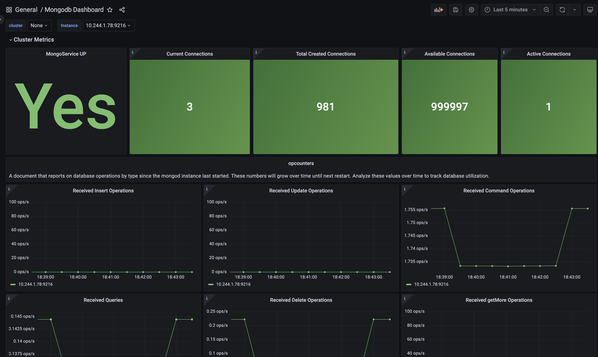

# Redis Observability on Kubernetes

Monitor a Redis StatefulSet in Kubernetes using **Prometheus** + **Redis Exporter** + **Grafana**.

---

## Architecture

```
redis-0 (StatefulSet)
    └── redis-exporter (Helm) → Prometheus (ServiceMonitor) → Grafana Dashboard
```

| Component          | Tool                                      |
|--------------------|------------------------------------------|
| Database           | Redis 6 — StatefulSet with 1Gi PVC       |
| Metrics Exporter   | prometheus-redis-exporter (Helm)         |
| Metrics Collection | Prometheus via ServiceMonitor            |
| Visualization      | Grafana — Redis Dashboard                |

---

## Prerequisites

- Kubernetes cluster (Docker Desktop or Minikube)
- `kubectl` and `helm` installed
- Prometheus + Grafana running in `monitoring` namespace

---

## Setup

### 1. Create Namespace & Redis

```bash
kubectl create namespace redis-monitoring

kubectl apply -f redis/redis-secret.yaml
kubectl apply -f redis/redis-service.yaml
kubectl apply -f redis/redis-statefulset.yaml
```

### 2. Install Redis Exporter

```bash
helm repo add prometheus-community https://prometheus-community.github.io/helm-charts
helm repo update

helm install redis-exporter prometheus-community/prometheus-redis-exporter \
  -f redis-exporter/redis-exporter-values.yaml \
  -n redis-monitoring
```

### 3. Deploy Grafana Dashboard

```bash
kubectl apply -f grafana/redis-dashboard.yaml -n monitoring
```

Restart Grafana to pick up the new dashboard:

```bash
kubectl rollout restart deployment prometheus-grafana -n monitoring
```

---

## Grafana Dashboard

To better understand the Redis observability setup, refer to the dashboard image below. It provides a clear visualization of the metrics and insights available for monitoring Redis:



---

## File Structure

```
k8s-redis-observability/
├── redis/
│   ├── redis-secret.yaml          # Base64 encoded credentials
│   ├── redis-service.yaml         # ClusterIP service on port 6379
│   └── redis-statefulset.yaml     # StatefulSet with 1Gi PVC
├── redis-exporter/
│   └── redis-exporter-values.yaml # Helm values with ServiceMonitor
├── grafana/
│   └── redis-dashboard.yaml       # ConfigMap with dashboard JSON
└── assets/
    └── redis-dashboard.png        # Dashboard screenshot
```

---

## Key Notes

- Redis credentials are stored as a Kubernetes Secret and injected via `secretKeyRef`
- The StatefulSet uses a `volumeClaimTemplate` to provision a PVC per replica, persisting data at `/data`
- The exporter connects over cluster DNS: `redis.redis-monitoring.svc.cluster.local`
- The `ServiceMonitor` uses `release: prometheus` label to be discovered by the Prometheus Operator